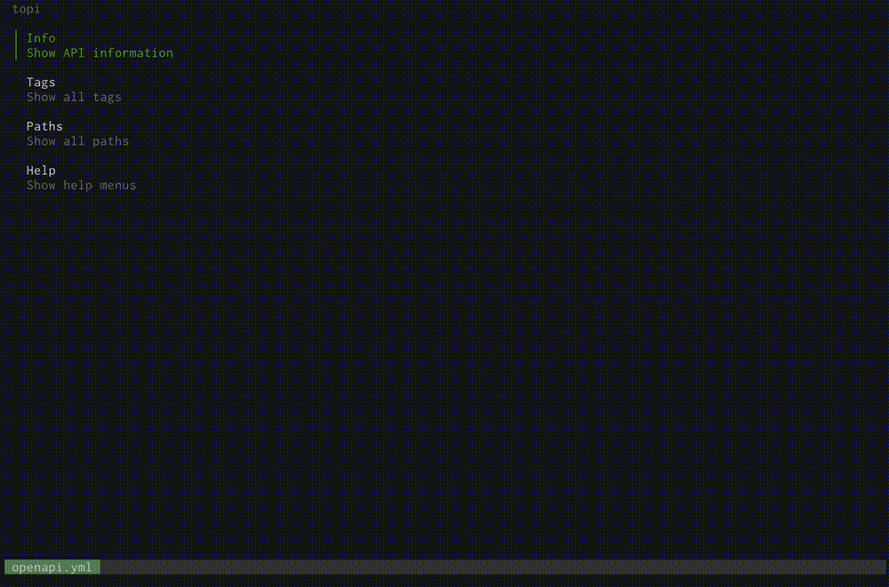

# topi

Terminal OpenAPI documentation viewer 🐐

## About

> topi is still under development... 🐐

topi is the documentation viewer for OpenAPI v3 definitions in the terminal.

(This image show https://github.com/github/rest-api-description)

## Installation

`$ go install github.com/lusingander/topi@latest`

(require Go 1.18+)

## Usage

`$ topi <path>`

> `path` can be local file path or remote URL.

### Keybindings

#### Common

common keybindings for all pages

|Key|Description|
|-|-|
|<kbd>Backspace</kbd>|back to perv page|
|<kbd>Ctrl+c</kbd>|quit|
|<kbd>?</kbd>|show help page|

#### List page

keybindings for list-syle pages 

|Key|Description|
|-|-|
|<kbd>j</kbd>|cursor down|
|<kbd>k</kbd>|cursor up|
|<kbd>f</kbd> <kbd>l</kbd>|next page|
|<kbd>b</kbd> <kbd>h</kbd>|prev page|
|<kbd>g</kbd>|go to start|
|<kbd>G</kbd>|go to end|
|<kbd>/</kbd>|Enter filtering mode|
|<kbd>Enter</kbd>|(default) select item, (filtering) apply filter|
|<kbd>Esc</kbd>|(filtering) cancel filter, (filter applied) remove filter|

#### Document page

keybindings for document pages 

|Key|Description|
|-|-|
|<kbd>j</kbd>|page down one line|
|<kbd>k</kbd>|page up one line|
|<kbd>f</kbd>|page down|
|<kbd>b</kbd>|page up|
|<kbd>d</kbd>|half page down|
|<kbd>u</kbd>|half page up|
|<kbd>Tab</kbd>|select link|
|<kbd>x</kbd>|open selecting link|

specific to the credits page

|Key|Description|
|-|-|
|<kbd>t</kbd>|toggle credits list|

## License

MIT
